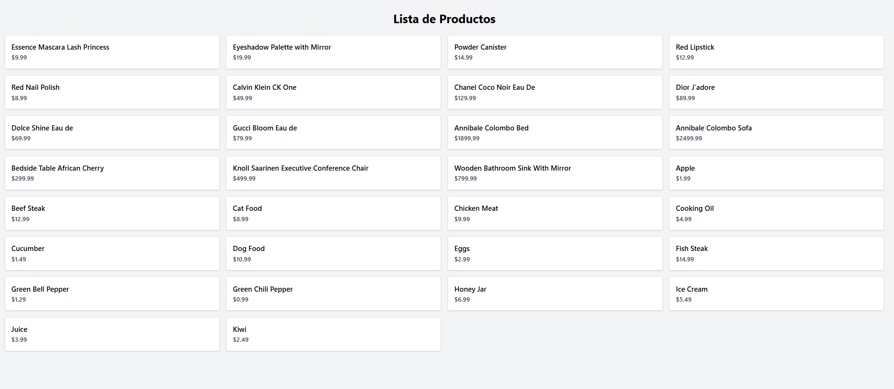

# proyecto integrador – React + Tailwind + Axios

Este proyecto muestra una lista de productos consumidos desde una API externa utilizando React, Tailwind CSS y Axios.

## tecnologías utilizadas

- Vite
- React
- Tailwind CSS
- Axios

## instalación

1. Cloná el repositorio:

```bash
git clone https://github.com/tu_usuario/Proyecto_Integrador.git
cd Proyecto_Integrador

##captura




App.jsx: tu componente principal. Acá vas a empezar a escribir tu app.

main.jsx: el archivo que inicia la app y monta el App en el navegador.

index.html: el HTML base (solo tiene un <div> donde se “inyecta” la app).

package.json: lista de los paquetes que usás.

vite.config.js: configuración de Vite (casi no vas a tocarlo ahora).